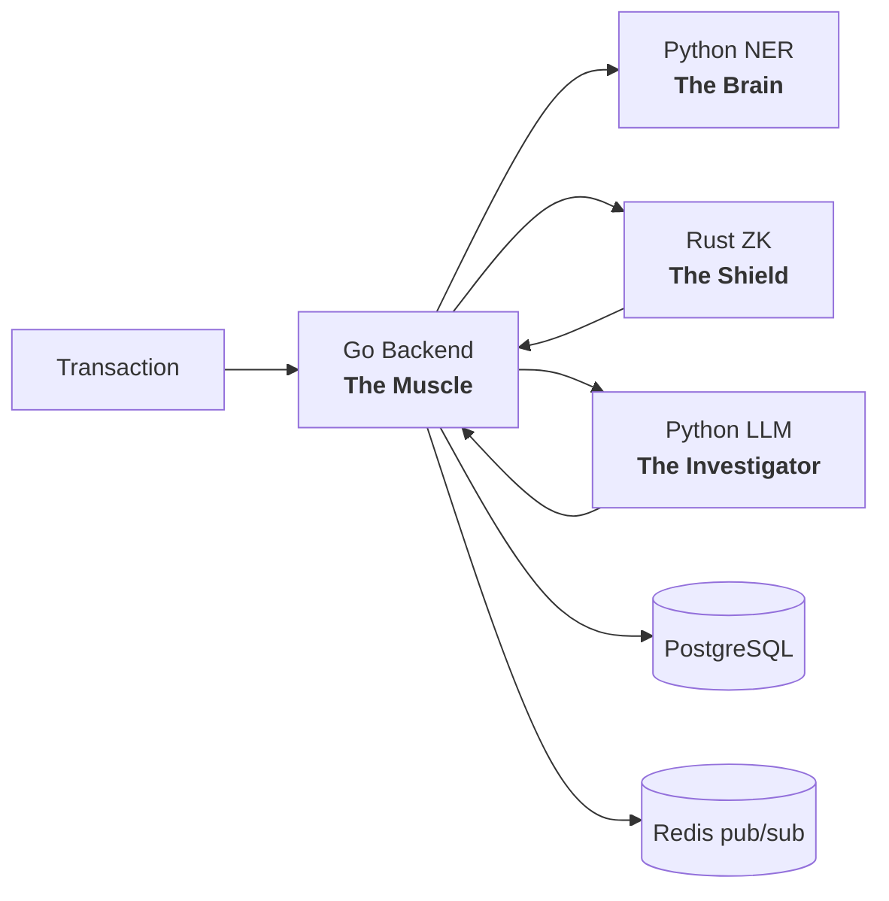
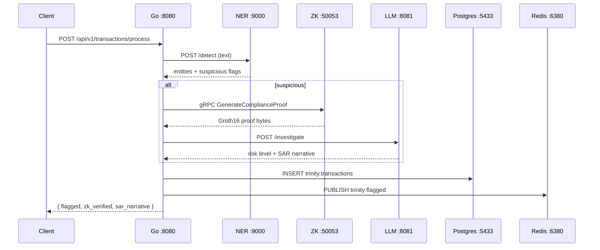

<!-- PyCon Kenya 2026 — The Compliance Trinity -->
<!-- slides-tape deck. Serve: npx slides-tape serve slides.md -->
<!-- Palette: #121213 (bg) · #10b981 (emerald) · #ffd43b (python yellow) · #fff -->

<div style="background:#121213; color:#fff; padding:2em; height:100%; display:flex; flex-direction:column; justify-content:center;">

<h1 style="color:#10b981; font-size:2.6em; margin:0;">The Compliance Trinity</h1>
<h2 style="color:#ffd43b; font-weight:normal; margin-top:0.4em;">Orchestrating Python, Go &amp; Rust for Private, AI-Powered AML</h2>

<p style="color:#e5e5e5; margin-top:2em; font-size:1.1em;">
Maurice Nyanja · <span style="color:#10b981;">@nutcas3</span><br>
<span style="color:#808080;">PyCon Kenya 2026 · Nairobi</span>
</p>

</div>

> Note: Welcome. 30 minutes. One question: how do you move fast, stay smart, and keep user data private — all at once?

---

<div style="background:#121213; color:#fff; padding:2em;">

# <span style="color:#10b981;">The Problem</span>

**AML compliance is stuck in the dial-up era**

- FinTech rails push <span style="color:#ffd43b;">thousands of TPS</span> — compliance crawls behind
- <span style="color:#ffd43b;">85% false positive rate</span> in traditional rule-based AML
- <span style="color:#ffd43b;">$180B</span> spent annually on compliance globally
- Privacy: <span style="color:#ff6b6b;">zero</span> — investigators see everything

> Note: Kenya moves money at M-Pesa scale. Compliance tooling hasn't kept up. To be fair, modern systems do mask PII and truncate account numbers — but that's cosmetic. The data still sits in plaintext in the database, and masking is policy-enforced, not mathematically enforced. ZK flips that: the verifier provably learns nothing.

</div>

---

<div style="background:#121213; color:#fff; padding:2em;">

# <span style="color:#10b981;">The Impossible Triangle</span>

<table style="width:100%; color:#e5e5e5; font-size:1.05em;">
<tr><th style="color:#ffd43b; text-align:left; padding:0.4em;">Goal</th><th style="color:#ffd43b; text-align:left; padding:0.4em;">Traditional answer</th></tr>
<tr><td style="padding:0.4em;">Speed</td><td style="padding:0.4em;">Skip the checks, pay the fines</td></tr>
<tr><td style="padding:0.4em;">Intelligence</td><td style="padding:0.4em;">Slow human review queues</td></tr>
<tr><td style="padding:0.4em;">Privacy</td><td style="padding:0.4em;">An afterthought at best</td></tr>
</table>

<h3 style="color:#10b981; margin-top:1em;">Pick two. That's what they tell you.</h3>

> Note: The insight of the Trinity: stop asking one language to do all three. Give each job to the tool that does it best.

</div>

---

<div style="background:#121213; color:#fff; padding:2em;">

# <span style="color:#10b981;">The Trinity</span>



<p style="color:#e5e5e5;">One pipeline. Four specialists. <span style="color:#ffd43b;">No compromises.</span></p>

</div>

> Note: Go ingests and orchestrates. Python NER resolves entities. Rust proves compliance without seeing data. Python LLM writes the SAR. Postgres persists, Redis fans out.

---

<div style="background:#121213; color:#fff; padding:2em;">

# <span style="color:#ffd43b;">Go</span> <span style="color:#808080;">— The Muscle</span>

**High-concurrency transaction orchestrator** · Go 1.27 · Gin

```go
// Pipeline: NER → (suspicious? ZK → LLM) → store → publish
entities, err := s.callNERService(ctx, tx)      // Python FastAPI
suspicious := isSuspicious(entities)            // explicit contract
if suspicious {
    zkVerified, _ := s.verifyWithZK(ctx, tx, entities)   // Rust gRPC
    narrative, _  := s.callLLMService(ctx, tx, entities) // Python LLM
}
s.storeTransaction(tx, response)   // PostgreSQL
s.publishEvents(ctx, tx, response) // Redis: trinity:flagged, trinity:sars
```

<p style="color:#808080;">slog JSON logging · Prometheus /metrics · request-ID middleware · fails fast on missing config</p>

</div>

> Note: Firebase was replaced by Redis pub/sub — no cloud dependency, everything self-hosted.

---

<div style="background:#121213; color:#fff; padding:2em;">

# <span style="color:#ffd43b;">Python NER</span> <span style="color:#808080;">— The Brain</span>

**GLINER zero-shot entity detection** · Python 3.14 · FastAPI

```python
class Entity(BaseModel):
    type: str                              # "Person", "Company", ...
    text: str
    suspicious: bool = False               # ← explicit flag
    sanctions_matches: List[SanctionMatch] = []
```

- Sanctions matching via fuzzy scoring — <span style="color:#10b981;">type is never mutated</span>
- Redis-cached predictions &amp; sanctions lookups
- Model downloads at runtime → cached in a Docker volume

> Note: The contract is the fix — Go used to string-match "Person (SUSPICIOUS)". Now suspicion is structural data, not a string hack.

</div>

---

<div style="background:#121213; color:#fff; padding:2em;">

# <span style="color:#ffd43b;">Rust ZK</span> <span style="color:#808080;">— The Shield</span>

**Real arkworks Groth16 on Bn254** · Rust 1.95 · tonic gRPC

> *"I know an `amount` below a public `threshold`, and `poseidon(sender)` is not the `sanctions_root`."*

```rust
// Constraint 1: amount < threshold  (64-bit range check)
// Constraint 2: sender_hash ≠ sanctions_root  (inverse exists ⇔ non-zero)
let proof = Groth16::<Bn254>::prove(&pk, circuit, &mut rng)?;
let ok = Groth16::<Bn254>::verify(&vk, &public_inputs, &proof)?;
```

- gRPC on <span style="color:#10b981;">:50053</span> · Prometheus on <span style="color:#10b981;">:9100</span>
- PyO3 bindings behind a `python` feature flag

> Note: Not a mock. The verifier learns ONLY that the transaction is compliant — never the amount, never the sender.

</div>

---

<div style="background:#121213; color:#fff; padding:2em;">

# <span style="color:#ffd43b;">Python LLM</span> <span style="color:#808080;">— The Investigator</span>

**Pluggable providers** · Python 3.14 · FastAPI

```python
@runtime_checkable
class LLMProvider(Protocol):
    async def chat(self, messages, json_mode=False) -> LLMResponse: ...
    async def health(self) -> bool: ...
```

| Provider | When | API key |
|---|---|---|
| <span style="color:#10b981;">Ollama</span> (default) | Self-hosted, on-prem, data sovereignty | none |
| <span style="color:#10b981;">OpenAI</span> | Production scale | `OPENAI_API_KEY` |

Structured JSON risk output → SAR narrative. Failure = HTTP 503, no silent mocks.

> Note: Ollama means the SAR investigation happens in-country. Data never leaves Kenya.

</div>

---

<div style="background:#121213; color:#fff; padding:2em;">

# <span style="color:#10b981;">One Contract, Four Languages</span>

```protobuf
service ZKComplianceService {
  rpc VerifyComplianceProof(VerifyProofRequest)   returns (VerifyProofResponse);
  rpc GenerateComplianceProof(GenerateProofRequest) returns (GenerateProofResponse);
  rpc PoseidonHash(HashRequest)                   returns (HashResponse);
  rpc VerifyMerkleProof(MerkleProofRequest)       returns (MerkleProofResponse);
  rpc Health(HealthRequest)                       returns (HealthResponse);
}
```

<p style="color:#e5e5e5;"><code>contracts/proto/trinity.proto</code> + <code>contracts/openapi.yaml</code> — the single source of truth every service conforms to.</p>

> Note: Polyglot only works if the contract is shared. Proto for gRPC (Go↔Rust), OpenAPI for REST.

</div>

---

<div style="background:#121213; color:#fff; padding:2em;">

# <span style="color:#10b981;">The Full Pipeline</span>



</div>

> Note: Walk the diagram left to right — this is exactly what the live demo exercises next.

---

<div style="background:#121213; color:#fff; padding:2em;">

# <span style="color:#ffd43b;">Live Demo</span> — Boot the Stack

```bash run
# @echo off
# @ps1 "\033[1;32m➜\033[0m "
# @type "# One command brings up the whole self-hosted stack"
# @type "cp .env.example .env && make setup && make up"
# @wait 1s
# @print ""
# @print "\033[32m✔\033[0m postgres   :5433   \033[32m✔\033[0m redis      :6380"
# @print "\033[32m✔\033[0m go-backend :8080   \033[32m✔\033[0m python-ner :9000"
# @print "\033[32m✔\033[0m rust-zk    :50053  \033[32m✔\033[0m llm-svc    :8081"
# @print "\033[32m✔\033[0m ollama     :11434  \033[32m✔\033[0m prometheus :9090  grafana :3000"
# @wait 1s
# @type "make demo-check"
# @wait 800ms
# @print "\033[32mAll services healthy.\033[0m"
```

</div>

> Note: If Docker is up, actually run it — otherwise the scripted block narrates the same output.

---

<div style="background:#121213; color:#fff; padding:2em;">

# <span style="color:#ffd43b;">Live Demo</span> — Sanctions Hit

```bash run
# @echo off
# @ps1 "\033[1;32m➜\033[0m "
# @type "curl -s localhost:8080/api/v1/transactions/process -d '{...}'"
curl -s -X POST http://localhost:8080/api/v1/transactions/process \
  -H "Content-Type: application/json" \
  -d '{"id":"txn_001","sender":"M. Emmanuel","receiver":"Offshore Account","amount":25000,"currency":"USD","description":"Business investment transfer"}'
# @wait 1s
```

**Expected:** NER flags `M. Emmanuel` → ZK proof generated → LLM writes SAR → `flagged: true`

> Note: M. Emmanuel is a seeded sanctions record in init-db.sql. Watch zk_verified in the JSON response — that's the Rust service answering over gRPC.

</div>

---

<div style="background:#121213; color:#fff; padding:2em;">

# <span style="color:#ffd43b;">Live Demo</span> — NER Contract Up Close

```bash run
# @echo off
# @ps1 "\033[1;32m➜\033[0m "
# @type "curl -s localhost:9000/detect ..."
curl -s -X POST http://localhost:9000/detect \
  -H "Content-Type: application/json" \
  -d '{"text":"M. Emmanuel sent $25,000 to Offshore Account for business investment"}'
# @wait 1s
```

```json
{ "type": "Person", "text": "M. Emmanuel",
  "suspicious": true,
  "sanctions_matches": [{ "name": "M. Emmanuel", "risk_level": "HIGH" }] }
```

<p style="color:#808080;">Type stays <code>Person</code>. Suspicion is data.</p>

</div>

---

<div style="background:#121213; color:#fff; padding:2em;">

# <span style="color:#ffd43b;">Live Demo</span> — Full Pipeline

```bash run
# @echo off
# @ps1 "\033[1;32m➜\033[0m "
# @type "python -m trinity_demo.live_demo"
# @wait 1s
# @print "\033[36m[SCENARIO 1]\033[0m Sanctions evasion ......... FLAGGED  (zk_verified=true)"
# @print "\033[36m[SCENARIO 2]\033[0m Structuring pattern ........ FLAGGED  (sar_generated=true)"
# @print "\033[36m[SCENARIO 3]\033[0m High-volume x5000 .......... done"
# @wait 1s
# @print "\033[33mProcessed: 5000 tx · Flagged: 47 · SARs: 47\033[0m"
```

```web run
# @goto http://localhost:3000
# @wait 2s
```

<p style="color:#808080;">Grafana at :3000 — live throughput, flag rate, per-service latency.</p>

</div>

> Note: The web block opens Grafana headlessly if the stack is running; skip it if not.

---

<div style="background:#121213; color:#fff; padding:2em;">

# <span style="color:#10b981;">Why It Matters for Kenya</span>

- **Data sovereignty** — Ollama + self-hosted stack: <span style="color:#ffd43b;">nothing leaves the country</span>
- **Cost** — open-source stack vs six-figure vendor compliance suites
- **Talent** — Python devs already here can operate the brain and the investigator
- **Precedent** — privacy-preserving compliance is a pattern other sectors can copy

> Note: Silicon Savannah isn't just consuming fintech — we're building the compliance infrastructure too.

</div>

---

<div style="background:#121213; color:#fff; padding:2em;">

# <span style="color:#10b981;">Takeaways</span>

1. <span style="color:#ffd43b;">Python conducts</span> — it doesn't have to do everything itself
2. <span style="color:#ffd43b;">Polyglot works</span> — when contracts are shared (proto + OpenAPI)
3. <span style="color:#ffd43b;">Privacy is provable</span> — real Groth16, not theater
4. <span style="color:#ffd43b;">Self-hosted is viable</span> — Ollama + GLINER + Redis, zero cloud keys
5. <span style="color:#ffd43b;">It's deployable</span> — `make setup && make up && make demo`

</div>

---

<div style="background:#121213; color:#fff; padding:2em; height:100%; display:flex; flex-direction:column; justify-content:center; text-align:center;">

<h1 style="color:#10b981; font-size:3em; margin:0;">Asante sana</h1>
<p style="color:#ffd43b; font-size:1.3em;">Questions?</p>
<p style="color:#e5e5e5; margin-top:2em;">@nutcas3 · github.com/nutcas3/aml-open-source</p>

</div>

> Note: Repo is public — every file shown today is in it. Grab it, run make up, break it, PR it.
