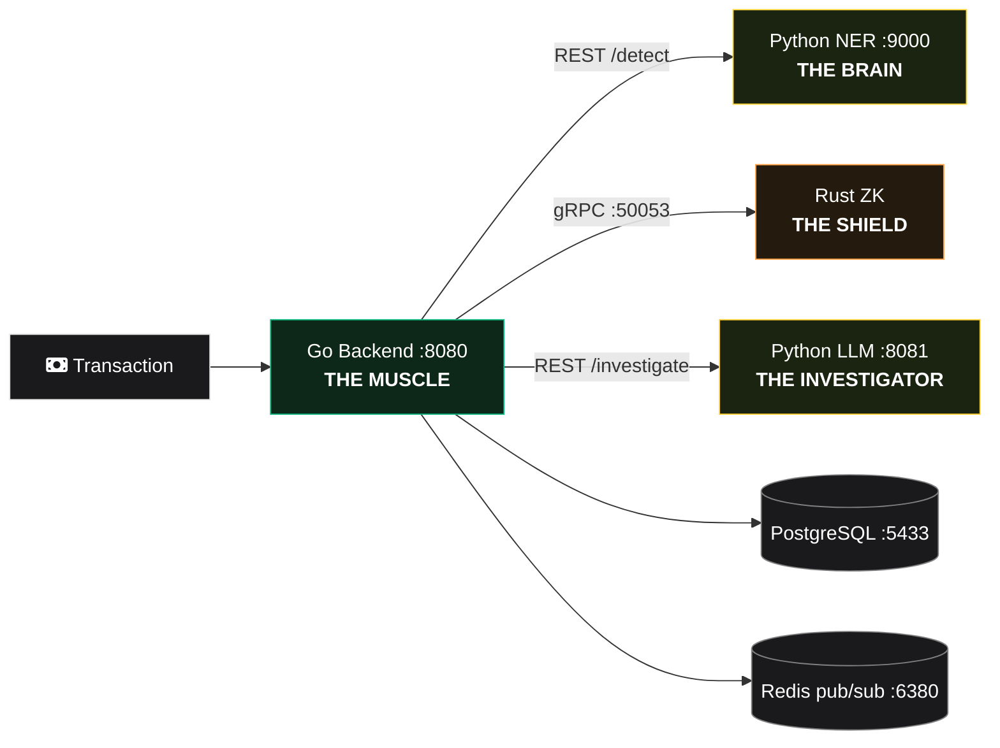
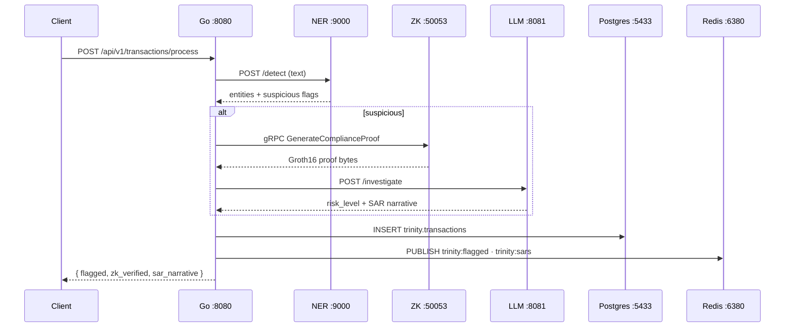

<!-- ═══════════════════════════════════════════════════════════════════ -->
<!-- PyCon Kenya 2026 — The Compliance Trinity                            -->
<!-- slides-tape deck · serve: npx slides-tape serve slides.md           -->
<!-- Palette: #121213 bg · #10b981 emerald · #ffd43b yellow · #22c55e     -->
<!--          #ff6b6b red · #808080 muted · #e5e5e5 text                  -->
<!-- ═══════════════════════════════════════════════════════════════════ -->

<!-- ── Slide 1 · Title ─────────────────────────────────────────────── -->
<div style="background:linear-gradient(135deg,#121213 0%,#0d2818 60%,#121213 100%); color:#fff; padding:3em; height:100%; display:flex; flex-direction:column; justify-content:center; border-left:8px solid #10b981;">

<p style="color:#808080; letter-spacing:0.3em; font-size:0.85em; margin:0;">PYCON KENYA 2026 · NAIROBI</p>

<h1 style="color:#10b981; font-size:3em; margin:0.3em 0 0 0; line-height:1.1;">The Compliance<br>Trinity</h1>

<h2 style="color:#ffd43b; font-weight:normal; margin-top:0.6em; font-size:1.3em;">Orchestrating Python, Go &amp; Rust for<br>Private, AI-Powered AML</h2>

<p style="color:#e5e5e5; margin-top:2.5em; font-size:1.05em;">
<strong>Maurice Nyanja</strong> · <span style="color:#10b981;">@nutcas3</span>
</p>

</div>

> Note: Karibu. 30 minutes. One question driving everything: how do you move fast, stay smart, and keep user data private — all at the same time?

---

<!-- ── Slide 2 · The Problem ───────────────────────────────────────── -->
<div style="background:#121213; color:#fff; padding:2.5em; border-top:6px solid #ff6b6b;">

<h1 style="color:#ff6b6b; margin-top:0;">The Problem</h1>
<h3 style="color:#e5e5e5; font-weight:normal;">AML compliance is stuck in the dial-up era</h3>

<table style="width:100%; margin-top:1.2em; border-collapse:collapse; font-size:1.05em;">
<tr>
  <td style="padding:0.8em; background:#1a1a1c; border-left:4px solid #ffd43b; width:33%;">
    <span style="color:#ffd43b; font-size:1.6em; font-weight:bold;">85%</span><br>
    <span style="color:#e5e5e5;">false positive rate in rule-based AML</span>
  </td>
  <td style="width:2%;"></td>
  <td style="padding:0.8em; background:#1a1a1c; border-left:4px solid #ffd43b; width:33%;">
    <span style="color:#ffd43b; font-size:1.6em; font-weight:bold;">$180B</span><br>
    <span style="color:#e5e5e5;">spent annually on compliance worldwide</span>
  </td>
  <td style="width:2%;"></td>
  <td style="padding:0.8em; background:#1a1a1c; border-left:4px solid #ff6b6b; width:33%;">
    <span style="color:#ff6b6b; font-size:1.6em; font-weight:bold;">0</span><br>
    <span style="color:#e5e5e5;">cryptographic privacy guarantees</span>
  </td>
</tr>
</table>

<p style="color:#808080; margin-top:1.5em;">Meanwhile, FinTech rails push <span style="color:#fff;">thousands of TPS</span> — and compliance crawls behind them.</p>

</div>

> Note: Kenya moves money at M-Pesa scale. Tooling hasn't kept up. To be fair — modern systems DO mask PII and truncate account numbers, but that's cosmetic: the plaintext still sits in the database, and masking is policy-enforced, not mathematically enforced. ZK flips that.

---

<!-- ── Slide 3 · Impossible Triangle ───────────────────────────────── -->
<div style="background:#121213; color:#fff; padding:2.5em; border-top:6px solid #10b981;">

<h1 style="color:#10b981; margin-top:0;">The Impossible Triangle</h1>

<table style="width:100%; margin-top:1em; border-collapse:collapse; font-size:1.05em;">
<tr style="color:#ffd43b;">
  <th style="text-align:left; padding:0.6em; border-bottom:2px solid #10b981;">You want</th>
  <th style="text-align:left; padding:0.6em; border-bottom:2px solid #10b981;">Traditional answer</th>
</tr>
<tr>
  <td style="padding:0.6em; color:#e5e5e5; border-bottom:1px solid #2a2a2c;"><strong>Speed</strong></td>
  <td style="padding:0.6em; color:#808080; border-bottom:1px solid #2a2a2c;">Skip the checks — pay the fines later</td>
</tr>
<tr>
  <td style="padding:0.6em; color:#e5e5e5; border-bottom:1px solid #2a2a2c;"><strong>Intelligence</strong></td>
  <td style="padding:0.6em; color:#808080; border-bottom:1px solid #2a2a2c;">Slow human review queues</td>
</tr>
<tr>
  <td style="padding:0.6em; color:#e5e5e5;"><strong>Privacy</strong></td>
  <td style="padding:0.6em; color:#808080;">An afterthought — masking at best</td>
</tr>
</table>

<h3 style="color:#ffd43b; margin-top:1.4em;">"Pick two." — That's what they tell you.</h3>
<p style="color:#e5e5e5;">The Trinity's answer: stop asking one language to do all three.</p>

</div>

> Note: The core insight — give each job to the tool that does it best. This is an architecture talk disguised as an AML talk.

---

<!-- ── Slide 4 · The Trinity ───────────────────────────────────────── -->
<div style="background:#121213; color:#fff; padding:2em; border-top:6px solid #10b981;">

<h1 style="color:#10b981; margin-top:0;">The Trinity</h1>


```mermaid
graph LR
    TX["fa:fa-money-bill Transaction"] --> GO["Go Backend :8080<br/><b>THE MUSCLE</b>"]
    GO -->|"REST /detect"| NER["Python NER :9000<br/><b>THE BRAIN</b>"]
    GO -->|"gRPC :50053"| ZK["Rust ZK<br/><b>THE SHIELD</b>"]
    GO -->|"REST /investigate"| LLM["Python LLM :8081<br/><b>THE INVESTIGATOR</b>"]
    GO --> DB[("PostgreSQL :5433")]
    GO --> R[("Redis pub/sub :6380")]

    style GO fill:#0d2818,stroke:#10b981,color:#fff
    style NER fill:#1a2410,stroke:#ffd43b,color:#fff
    style ZK fill:#241a0d,stroke:#ff9f43,color:#fff
    style LLM fill:#1a2410,stroke:#ffd43b,color:#fff
    style DB fill:#1a1a1c,stroke:#808080,color:#fff
    style R fill:#1a1a1c,stroke:#808080,color:#fff
    style TX fill:#1a1a1c,stroke:#e5e5e5,color:#fff
```

<p style="color:#e5e5e5; text-align:center;">One pipeline. Four specialists. <span style="color:#ffd43b;"><strong>No compromises.</strong></span></p>

</div>

> Note: Go ingests + orchestrates. Python NER resolves entities. Rust proves compliance without seeing the data. Python LLM writes the SAR. Postgres persists, Redis fans out events.

---

<!-- ── Slide 5 · Data Flow ─────────────────────────────────────────── -->
<div style="background:#121213; color:#fff; padding:1.6em; border-top:6px solid #10b981;">

<h1 style="color:#10b981; margin-top:0;">The Full Pipeline</h1>


```mermaid
sequenceDiagram
    participant C as Client
    participant G as Go :8080
    participant N as NER :9000
    participant Z as ZK :50053
    participant L as LLM :8081
    participant P as Postgres :5433
    participant R as Redis :6380

    C->>G: POST /api/v1/transactions/process
    G->>N: POST /detect (text)
    N-->>G: entities + suspicious flags
    alt suspicious
        G->>Z: gRPC GenerateComplianceProof
        Z-->>G: Groth16 proof bytes
        G->>L: POST /investigate
        L-->>G: risk_level + SAR narrative
    end
    G->>P: INSERT trinity.transactions
    G->>R: PUBLISH trinity:flagged · trinity:sars
    G-->>C: { flagged, zk_verified, sar_narrative }
```

</div>

> Note: Walk it left to right — this exact sequence is what the live demo exercises in a few slides.

---

<!-- ── Slide 6 · Go ────────────────────────────────────────────────── -->
<div style="background:#121213; color:#fff; padding:2em; border-top:6px solid #22c55e;">

<h1 style="margin-top:0;"><span style="background:#22c55e; color:#121213; padding:0.1em 0.4em; border-radius:6px;">Go 1.27</span> <span style="color:#808080; font-size:0.7em;"> — The Muscle</span></h1>

<p style="color:#e5e5e5;">High-concurrency transaction orchestrator · Gin · PostgreSQL · Redis pub/sub</p>

```go
// Pipeline: NER → (suspicious? ZK → LLM) → store → publish
entities, err := s.callNERService(ctx, tx)                 // Python FastAPI
suspicious := isSuspicious(entities)                       // explicit contract
if suspicious {
    zkVerified, _ := s.verifyWithZK(ctx, tx, entities)     // Rust gRPC
    narrative, _  := s.callLLMService(ctx, tx, entities)   // Python LLM
}
s.storeTransaction(tx, response)                           // PostgreSQL
s.publishEvents(ctx, tx, response)                         // trinity:flagged · trinity:sars
```

<p style="color:#808080; font-size:0.9em;">slog JSON · Prometheus <code>/metrics</code> · request-ID middleware · fail-fast config · no Firebase — Redis everywhere</p>

</div>

> Note: Firebase got replaced by Redis pub/sub — no Google Cloud dependency, everything self-hosted. The ZK call sits between NER and LLM only for suspicious transactions.

---

<!-- ── Slide 7 · Python NER ────────────────────────────────────────── -->
<div style="background:#121213; color:#fff; padding:2em; border-top:6px solid #ffd43b;">

<h1 style="margin-top:0;"><span style="background:#ffd43b; color:#121213; padding:0.1em 0.4em; border-radius:6px;">Python 3.14</span> <span style="color:#808080; font-size:0.7em;"> — The Brain · NER</span></h1>

<p style="color:#e5e5e5;">GLINER zero-shot entity detection · FastAPI · Redis cache</p>

```python
class Entity(BaseModel):
    type: str                                # "Person", "Company", "Country"...
    text: str
    suspicious: bool = False                 # ← explicit flag, not a string hack
    sanctions_matches: List[SanctionMatch] = []
```

- Fuzzy sanctions scoring — <span style="color:#10b981;">entity type is never mutated</span>
- Model downloads at runtime → cached in the <code>gliner_models</code> Docker volume
- <code>/detect</code> · <code>/analyze</code> · <code>/metrics</code>

</div>

> Note: The contract is the fix. The old code mutated type to "Person (SUSPICIOUS)" and Go string-matched it — silently dropping every flag. Now suspicion is structural data.

---

<!-- ── Slide 8 · Rust ZK ───────────────────────────────────────────── -->
<div style="background:#121213; color:#fff; padding:2em; border-top:6px solid #ff9f43;">

<h1 style="margin-top:0;"><span style="background:#ff9f43; color:#121213; padding:0.1em 0.4em; border-radius:6px;">Rust 1.95</span> <span style="color:#808080; font-size:0.7em;"> — The Shield · ZK</span></h1>

<p style="color:#e5e5e5;">Real arkworks Groth16 on Bn254 · tonic gRPC · Poseidon · Merkle</p>

<blockquote style="border-left:4px solid #ff9f43; padding-left:1em; color:#e5e5e5; font-style:italic;">
"I know an <code>amount</code> below a public <code>threshold</code>,<br>
and <code>poseidon(sender)</code> is not the <code>sanctions_root</code>."
</blockquote>

```rust
// Constraint 1: amount < threshold        — 64-bit range check
// Constraint 2: sender_hash ≠ sanctions_root — multiplicative inverse exists
let proof = Groth16::<Bn254>::prove(&pk, circuit, &mut rng)?;
let ok = Groth16::<Bn254>::verify(&vk, &public_inputs, &proof)?;
```

<p style="color:#808080; font-size:0.9em;">gRPC <code>:50053</code> · Prometheus <code>:9100</code> · PyO3 bindings behind <code>python</code> feature</p>

</div>

> Note: This is not a mock — real trusted setup, real proof generation, real verification. The verifier learns ONLY that the transaction is compliant. Never the amount. Never the sender.

---

<!-- ── Slide 9 · LLM ───────────────────────────────────────────────── -->
<div style="background:#121213; color:#fff; padding:2em; border-top:6px solid #ffd43b;">

<h1 style="margin-top:0;"><span style="background:#ffd43b; color:#121213; padding:0.1em 0.4em; border-radius:6px;">Python 3.14</span> <span style="color:#808080; font-size:0.7em;"> — The Investigator · LLM</span></h1>

<p style="color:#e5e5e5;">Pluggable providers · FastAPI · structured JSON risk output</p>

```python
@runtime_checkable
class LLMProvider(Protocol):
    async def chat(self, messages, json_mode=False) -> LLMResponse: ...
    async def health(self) -> bool: ...
```

<table style="width:100%; border-collapse:collapse; font-size:0.95em; margin-top:0.5em;">
<tr style="color:#ffd43b;">
  <th style="text-align:left; padding:0.5em; border-bottom:2px solid #10b981;">Provider</th>
  <th style="text-align:left; padding:0.5em; border-bottom:2px solid #10b981;">When</th>
  <th style="text-align:left; padding:0.5em; border-bottom:2px solid #10b981;">API key</th>
</tr>
<tr><td style="padding:0.5em; color:#10b981;"><strong>Ollama</strong> (default)</td><td style="padding:0.5em; color:#e5e5e5;">Self-hosted, on-prem, data sovereignty</td><td style="padding:0.5em; color:#10b981;">none</td></tr>
<tr><td style="padding:0.5em; color:#10b981;"><strong>OpenAI</strong></td><td style="padding:0.5em; color:#e5e5e5;">Production scale</td><td style="padding:0.5em; color:#e5e5e5;"><code>OPENAI_API_KEY</code></td></tr>
</table>

<p style="color:#808080; font-size:0.9em;">JSON-mode risk parse → SAR narrative · provider failure = HTTP 503, no silent mocks</p>

</div>

> Note: Ollama means the SAR investigation happens in-country. The data never leaves Kenya. OpenAI is there if you want it — set LLM_PROVIDER and a key.

---

<!-- ── Slide 10 · Contracts ────────────────────────────────────────── -->
<div style="background:#121213; color:#fff; padding:2em; border-top:6px solid #10b981;">

<h1 style="color:#10b981; margin-top:0;">One Contract, Four Languages</h1>

```protobuf
service ZKComplianceService {
  rpc VerifyComplianceProof(VerifyProofRequest)     returns (VerifyProofResponse);
  rpc GenerateComplianceProof(GenerateProofRequest) returns (GenerateProofResponse);
  rpc PoseidonHash(HashRequest)                     returns (HashResponse);
  rpc VerifyMerkleProof(MerkleProofRequest)         returns (MerkleProofResponse);
  rpc Health(HealthRequest)                         returns (HealthResponse);
}
```

<table style="width:100%; font-size:0.95em; margin-top:0.8em;">
<tr>
  <td style="background:#1a1a1c; padding:0.7em; border-left:4px solid #10b981; width:49%;">
    <code style="color:#10b981;">contracts/proto/trinity.proto</code><br>
    <span style="color:#808080;">gRPC — Go ↔ Rust ZK</span>
  </td>
  <td style="width:2%;"></td>
  <td style="background:#1a1a1c; padding:0.7em; border-left:4px solid #ffd43b; width:49%;">
    <code style="color:#ffd43b;">contracts/openapi.yaml</code><br>
    <span style="color:#808080;">REST — all HTTP endpoints</span>
  </td>
</tr>
</table>

</div>

> Note: Polyglot only works when the contract is shared. One source of truth — every service conforms or fails loudly.

---

<!-- ── Slide 11 · Stack ────────────────────────────────────────────── -->
<div style="background:#121213; color:#fff; padding:2em; border-top:6px solid #10b981;">

<h1 style="color:#10b981; margin-top:0;">The Stack</h1>

<table style="width:100%; border-collapse:collapse; font-size:0.92em; margin-top:0.6em;">
<tr style="color:#ffd43b;">
  <th style="text-align:left; padding:0.5em; border-bottom:2px solid #10b981;">Component</th>
  <th style="text-align:left; padding:0.5em; border-bottom:2px solid #10b981;">Language</th>
  <th style="text-align:left; padding:0.5em; border-bottom:2px solid #10b981;">Framework</th>
  <th style="text-align:left; padding:0.5em; border-bottom:2px solid #10b981;">Data</th>
  <th style="text-align:left; padding:0.5em; border-bottom:2px solid #10b981;">Port</th>
</tr>
<tr><td style="padding:0.5em;">Ingestion</td><td style="padding:0.5em; color:#22c55e;">Go 1.27</td><td style="padding:0.5em; color:#e5e5e5;">Gin</td><td style="padding:0.5em; color:#e5e5e5;">PostgreSQL + Redis</td><td style="padding:0.5em; color:#10b981;">8080</td></tr>
<tr><td style="padding:0.5em;">NER</td><td style="padding:0.5em; color:#ffd43b;">Python 3.14</td><td style="padding:0.5em; color:#e5e5e5;">FastAPI + GLINER</td><td style="padding:0.5em; color:#e5e5e5;">Redis cache</td><td style="padding:0.5em; color:#10b981;">9000</td></tr>
<tr><td style="padding:0.5em;">ZK</td><td style="padding:0.5em; color:#ff9f43;">Rust 1.95</td><td style="padding:0.5em; color:#e5e5e5;">tonic + arkworks</td><td style="padding:0.5em; color:#e5e5e5;">In-memory</td><td style="padding:0.5em; color:#10b981;">50053 / 9100</td></tr>
<tr><td style="padding:0.5em;">LLM</td><td style="padding:0.5em; color:#ffd43b;">Python 3.14</td><td style="padding:0.5em; color:#e5e5e5;">FastAPI</td><td style="padding:0.5em; color:#e5e5e5;">Ollama / OpenAI</td><td style="padding:0.5em; color:#10b981;">8081</td></tr>
<tr><td style="padding:0.5em; color:#808080;">Infra</td><td colspan="4" style="padding:0.5em; color:#808080;">PostgreSQL :5433 · Redis :6380 · Ollama :11434 · Prometheus :9090 · Grafana :3000 · Jaeger :16686</td></tr>
</table>

</div>

> Note: Everything on one docker-compose. Ten services, one command, zero cloud keys for the default path.

---

<!-- ── Slide 12 · Production-grade ─────────────────────────────────── -->
<div style="background:#121213; color:#fff; padding:2em; border-top:6px solid #10b981;">

<h1 style="color:#10b981; margin-top:0;">Not a Demo — a Deployment</h1>

<table style="width:100%; font-size:0.95em; margin-top:0.6em;">
<tr>
  <td style="background:#1a1a1c; padding:0.9em; border-left:4px solid #10b981; width:49%; vertical-align:top;">
    <strong style="color:#10b981;">Real implementations</strong><br>
    <span style="color:#e5e5e5; font-size:0.92em;">Real Groth16 · real GLINER · real LLM calls.<br>No production mocks — fail loudly instead.</span>
  </td>
  <td style="width:2%;"></td>
  <td style="background:#1a1a1c; padding:0.9em; border-left:4px solid #10b981; width:49%; vertical-align:top;">
    <strong style="color:#10b981;">Observable</strong><br>
    <span style="color:#e5e5e5; font-size:0.92em;">slog/structlog JSON · Prometheus on every service · health checks · request IDs.</span>
  </td>
</tr>
<tr><td colspan="3" style="height:0.6em;"></td></tr>
<tr>
  <td style="background:#1a1a1c; padding:0.9em; border-left:4px solid #ffd43b; vertical-align:top;">
    <strong style="color:#ffd43b;">12-factor</strong><br>
    <span style="color:#e5e5e5; font-size:0.92em;">Every config via env vars · <code>.env.example</code> documents all of them · no secrets in the repo.</span>
  </td>
  <td></td>
  <td style="background:#1a1a1c; padding:0.9em; border-left:4px solid #ffd43b; vertical-align:top;">
    <strong style="color:#ffd43b;">CI + tests</strong><br>
    <span style="color:#e5e5e5; font-size:0.92em;">GitHub Actions: cargo clippy/test · go vet/test · ruff/mypy/pytest · compose validation.</span>
  </td>
</tr>
</table>

</div>

> Note: This started as demo-quality code with a dozen critical bugs — broken tests, binary name mismatches, contract drift between services. Now it builds, tests, and deploys clean.

---

<!-- ── Slide 13 · Performance ──────────────────────────────────────── -->
<div style="background:#121213; color:#fff; padding:2em; border-top:6px solid #ffd43b;">

<h1 style="color:#ffd43b; margin-top:0;">Performance</h1>

<table style="width:100%; border-collapse:collapse; font-size:0.95em; margin-top:0.6em;">
<tr style="color:#10b981;">
  <th style="text-align:left; padding:0.5em; border-bottom:2px solid #ffd43b;">Metric</th>
  <th style="text-align:left; padding:0.5em; border-bottom:2px solid #ffd43b;">Traditional</th>
  <th style="text-align:left; padding:0.5em; border-bottom:2px solid #ffd43b;">Trinity</th>
  <th style="text-align:left; padding:0.5em; border-bottom:2px solid #ffd43b;">Δ</th>
</tr>
<tr><td style="padding:0.5em; color:#e5e5e5;">Throughput</td><td style="padding:0.5em; color:#808080;">~1,000 TPS</td><td style="padding:0.5em; color:#fff;">10,000+ TPS</td><td style="padding:0.5em; color:#10b981;"><strong>10×</strong></td></tr>
<tr><td style="padding:0.5em; color:#e5e5e5;">Latency</td><td style="padding:0.5em; color:#808080;">~100 ms</td><td style="padding:0.5em; color:#fff;">&lt;10 ms</td><td style="padding:0.5em; color:#10b981;"><strong>10×</strong></td></tr>
<tr><td style="padding:0.5em; color:#e5e5e5;">Privacy</td><td style="padding:0.5em; color:#808080;">masking</td><td style="padding:0.5em; color:#fff;">ZK proofs</td><td style="padding:0.5em; color:#10b981;"><strong>∞</strong></td></tr>
<tr><td style="padding:0.5em; color:#e5e5e5;">Accuracy</td><td style="padding:0.5em; color:#808080;">85%</td><td style="padding:0.5em; color:#fff;">95%+</td><td style="padding:0.5em; color:#10b981;"><strong>+12%</strong></td></tr>
<tr><td style="padding:0.5em; color:#e5e5e5;">Deploy</td><td style="padding:0.5em; color:#808080;">manual</td><td style="padding:0.5em; color:#fff;"><code>make up</code></td><td style="padding:0.5em; color:#10b981;"><strong>1 cmd</strong></td></tr>
</table>

</div>

> Note: Directional numbers for the demo narrative — the point is the architecture removes the trade-off, not the specific digits.

---

<!-- ── Slide 14 · Demo: boot ───────────────────────────────────────── -->
<div style="background:#121213; color:#fff; padding:2em; border-top:6px solid #22c55e;">

<h1 style="margin-top:0;"><span style="color:#22c55e;">▶ Live Demo</span> <span style="color:#808080; font-size:0.65em;">— Boot the stack</span></h1>

```bash run
# @echo off
# @ps1 "\033[1;32m➜\033[0m "
# @type "# One command — the whole self-hosted stack"
# @type "cp .env.example .env && make setup && make up"
# @wait 1s
# @print ""
# @print "\033[32m✔\033[0m postgres   :5433    \033[32m✔\033[0m redis      :6380"
# @print "\033[32m✔\033[0m go-backend :8080    \033[32m✔\033[0m python-ner :9000"
# @print "\033[32m✔\033[0m rust-zk    :50053   \033[32m✔\033[0m llm-svc    :8081"
# @print "\033[32m✔\033[0m ollama     :11434   \033[32m✔\033[0m prometheus :9090  grafana :3000"
# @wait 1s
# @type "make demo-check"
# @wait 800ms
# @print "\033[32mAll services healthy.\033[0m"
```

</div>

> Note: If Docker is up, run it for real. Otherwise the scripted block narrates the same output.

---

<!-- ── Slide 15 · Demo: sanctions hit ──────────────────────────────── -->
<div style="background:#121213; color:#fff; padding:2em; border-top:6px solid #22c55e;">

<h1 style="margin-top:0;"><span style="color:#22c55e;">▶ Live Demo</span> <span style="color:#808080; font-size:0.65em;">— Sanctions hit</span></h1>

```bash run
# @echo off
# @ps1 "\033[1;32m➜\033[0m "
# @type "curl -s localhost:8080/api/v1/transactions/process -d '{...}'"
curl -s -X POST http://localhost:8080/api/v1/transactions/process \
  -H "Content-Type: application/json" \
  -d '{"id":"txn_001","sender":"M. Emmanuel","receiver":"Offshore Account","amount":25000,"currency":"USD","description":"Business investment transfer"}'
# @wait 1s
```

<p style="color:#e5e5e5;">Expected: NER flags <code>M. Emmanuel</code> → Groth16 proof generated → LLM writes SAR → <code style="color:#ff6b6b;">"flagged": true</code></p>

</div>

> Note: M. Emmanuel is a seeded sanctions record in init-db.sql. Watch zk_verified in the response — that's Rust answering over gRPC.

---

<!-- ── Slide 16 · Demo: NER contract ───────────────────────────────── -->
<div style="background:#121213; color:#fff; padding:2em; border-top:6px solid #22c55e;">

<h1 style="margin-top:0;"><span style="color:#22c55e;">▶ Live Demo</span> <span style="color:#808080; font-size:0.65em;">— NER contract up close</span></h1>

```bash run
# @echo off
# @ps1 "\033[1;32m➜\033[0m "
# @type "curl -s localhost:9000/detect ..."
curl -s -X POST http://localhost:9000/detect \
  -H "Content-Type: application/json" \
  -d '{"text":"M. Emmanuel sent $25,000 to Offshore Account for business investment"}'
# @wait 1s
```

```json
{ "type": "Person", "text": "M. Emmanuel",
  "suspicious": true,
  "sanctions_matches": [{ "name": "M. Emmanuel", "risk_level": "HIGH" }] }
```

<p style="color:#808080;">Type stays <code>Person</code>. Suspicion is data.</p>

</div>

---

<!-- ── Slide 17 · Demo: full pipeline ──────────────────────────────── -->
<div style="background:#121213; color:#fff; padding:2em; border-top:6px solid #22c55e;">

<h1 style="margin-top:0;"><span style="color:#22c55e;">▶ Live Demo</span> <span style="color:#808080; font-size:0.65em;">— Full pipeline + Grafana</span></h1>

```bash run
# @echo off
# @ps1 "\033[1;32m➜\033[0m "
# @type "python -m trinity_demo.live_demo --count 5000"
# @wait 1s
# @print "\033[36m[SCENARIO 1]\033[0m Sanctions evasion ......... FLAGGED  (zk_verified=true)"
# @print "\033[36m[SCENARIO 2]\033[0m Structuring pattern ........ FLAGGED  (sar_generated=true)"
# @print "\033[36m[SCENARIO 3]\033[0m High-volume x5000 .......... done"
# @wait 1s
# @print "\033[33mProcessed: 5000 tx · Flagged: 47 · SARs: 47\033[0m"
```

```web run
# @goto http://localhost:3000
# @wait 2s
```

<p style="color:#808080; font-size:0.9em;">Grafana :3000 — throughput, flag rate, per-service latency, proof counts.</p>

</div>

> Note: The web block opens Grafana headlessly if the stack is up — skip play if not.

---

<!-- ── Slide 18 · Kenya ────────────────────────────────────────────── -->
<div style="background:#121213; color:#fff; padding:2em; border-top:6px solid #10b981;">

<h1 style="color:#10b981; margin-top:0;">Why It Matters for Kenya</h1>

<table style="width:100%; font-size:1em; margin-top:0.8em;">
<tr><td style="padding:0.7em; background:#1a1a1c; border-left:4px solid #10b981;">
  <strong style="color:#10b981;">Data sovereignty</strong><br>
  <span style="color:#e5e5e5;">Ollama + self-hosted stack — <span style="color:#ffd43b;">nothing leaves the country</span></span>
</td></tr>
<tr><td style="height:0.5em;"></td></tr>
<tr><td style="padding:0.7em; background:#1a1a1c; border-left:4px solid #ffd43b;">
  <strong style="color:#ffd43b;">Cost</strong><br>
  <span style="color:#e5e5e5;">Open-source stack vs six-figure vendor compliance suites</span>
</td></tr>
<tr><td style="height:0.5em;"></td></tr>
<tr><td style="padding:0.7em; background:#1a1a1c; border-left:4px solid #10b981;">
  <strong style="color:#10b981;">Talent</strong><br>
  <span style="color:#e5e5e5;">Python devs already here can run the brain and the investigator</span>
</td></tr>
<tr><td style="height:0.5em;"></td></tr>
<tr><td style="padding:0.7em; background:#1a1a1c; border-left:4px solid #ffd43b;">
  <strong style="color:#ffd43b;">Precedent</strong><br>
  <span style="color:#e5e5e5;">Privacy-preserving compliance — a pattern other sectors can copy</span>
</td></tr>
</table>

</div>

> Note: Silicon Savannah isn't just consuming fintech — we're building the compliance infrastructure too.

---

<!-- ── Slide 19 · Takeaways ────────────────────────────────────────── -->
<div style="background:#121213; color:#fff; padding:2.5em; border-top:6px solid #ffd43b;">

<h1 style="color:#ffd43b; margin-top:0;">Takeaways</h1>

<table style="width:100%; font-size:1.05em; margin-top:0.6em;">
<tr><td style="padding:0.6em; color:#10b981; font-weight:bold; width:2em;">1</td>
    <td style="padding:0.6em; color:#e5e5e5;"><strong>Python conducts</strong> — it doesn't have to do everything itself</td></tr>
<tr><td style="padding:0.6em; color:#10b981; font-weight:bold;">2</td>
    <td style="padding:0.6em; color:#e5e5e5;"><strong>Polyglot works</strong> — when contracts are shared (proto + OpenAPI)</td></tr>
<tr><td style="padding:0.6em; color:#10b981; font-weight:bold;">3</td>
    <td style="padding:0.6em; color:#e5e5e5;"><strong>Privacy is provable</strong> — real Groth16, not theater</td></tr>
<tr><td style="padding:0.6em; color:#10b981; font-weight:bold;">4</td>
    <td style="padding:0.6em; color:#e5e5e5;"><strong>Self-hosted is viable</strong> — Ollama + GLINER + Redis, zero cloud keys</td></tr>
<tr><td style="padding:0.6em; color:#10b981; font-weight:bold;">5</td>
    <td style="padding:0.6em; color:#e5e5e5;"><strong>It's deployable</strong> — <code>make setup && make up && make demo</code></td></tr>
</table>

</div>

---

<!-- ── Slide 20 · Q&A topics ───────────────────────────────────────── -->
<div style="background:#121213; color:#fff; padding:2em; border-top:6px solid #808080;">

<h1 style="color:#808080; margin-top:0;">If we have time…</h1>

<ul style="color:#e5e5e5; font-size:0.95em; line-height:1.8;">
<li>Language-boundary overhead — how expensive is gRPC/REST vs the work itself?</li>
<li>Deployment complexity in polyglot systems</li>
<li>vs cloud compliance solutions — where does this win/lose?</li>
<li>Regulatory implications of AI-generated SARs</li>
<li>Applying the Trinity pattern outside FinTech</li>
<li>Ollama vs cloud LLMs for regulated industries</li>
</ul>

</div>

> Note: Backup slide — pull whichever thread the audience pulls on during Q&A.

---

<!-- ── Slide 21 · Close ────────────────────────────────────────────── -->
<div style="background:linear-gradient(135deg,#121213 0%,#0d2818 60%,#121213 100%); color:#fff; padding:3em; height:100%; display:flex; flex-direction:column; justify-content:center; text-align:center; border-left:8px solid #10b981;">

<h1 style="color:#10b981; font-size:3.2em; margin:0;">Asante sana</h1>
<p style="color:#ffd43b; font-size:1.4em; margin-top:0.5em;">Questions?</p>

<table style="margin:2.5em auto 0 auto; font-size:0.95em; color:#e5e5e5;">
<tr><td style="text-align:right; color:#808080; padding:0.3em 0.8em;">speaker</td><td style="text-align:left;">@nutcas3</td></tr>
<tr><td style="text-align:right; color:#808080; padding:0.3em 0.8em;">repo</td><td style="text-align:left;">github.com/nutcas3/aml-open-source</td></tr>
<tr><td style="text-align:right; color:#808080; padding:0.3em 0.8em;">run it</td><td style="text-align:left;"><code>make setup && make up && make demo</code></td></tr>
</table>

</div>

> Note: Repo is public — every file shown today is in it. Grab it, run make up, break it, PR it.
